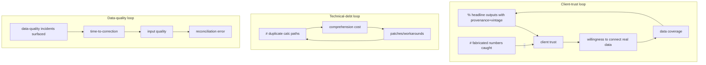

# Full Codebase System-Level Inspection — Enerlytics Energy-Management MVP

**Repo:** `osamaalshu/EnergyManagement` · inspected at branch `fix/audit-p0-baselines` (commit `d3f43aa`).
**Stance:** principal systems architect / data engineer / energy-product architect / systems-thinking auditor.
**Rule observed:** no code modified during this inspection. Builds on `WHOLE_SYSTEM_AUDIT.md` and `PROVENANCE_FRESHNESS_CONTRACT_PLAN.md`; this document is the *system-interaction* view.

> **Evidence:** **[F]** repository fact · **[I]** interpretation · **[D]** inferred intent · **[P]** proposed assumption · **[Q]** domain question · **[R]** recommendation. Confidence: High / Med / Low. Unverifiable items: **Insufficient evidence — external validation required.**

> ### Status relative to PR #2 — read this first
> **This is an audit artifact, not implemented remediation.** Findings fall in three buckets:
> - **✅ Remediated (in PR #2 or earlier merges):** hardcoded baselines → sourced (4.5 / P25); "Today/LIVE" framing → `Demo data` + `DatasetMeta`; decomposition reconciliation; signed tariff effect; physics → labeled diagnostic estimate; 2-hour + SUSPECT COP basis; integrity flag; finite-number + freshness-honesty build gate.
> - **🟡 Tracked & blocked (not changed):** chilled-water-flow `×10` / flow unit → **issue #3** (`data-contract`, `blocked`).
> - **🔴 Open — NOT implemented here (proposals only):** dual tariff engines (G1/C2), provenance dropped before the UI (G2), dead anomaly stock (G4), two COP definitions (G3), `mock` naming, missing→0, score heuristic. These are this report's *new* system-level findings and are scoped to a **future `fix/system-trust-seams` branch**.
>
> Throughout, **[F]** = repository fact, **[I]** = interpretation, **[Q]** = unresolved domain question, **[R]** = proposed intervention.

---

## 1. Executive System Assessment

**Is it one coherent system?** **Partly. It is a credible analytical *core* wrapped in a presentation *shell*, joined by a committed-JSON seam — but two structural seams leak meaning:** (a) **two independent CRT tariff engines** kept aligned only by a parity check, and (b) **provenance that exists in the data contract but is discarded before the UI.** Plus residual demo-vs-real framing (largely remediated this branch). **[I, High]**

**What genuinely works as a system:** CSV → preprocess/enrich → committed JSON → typed adapters → pages is a clean, deterministic seam (no backend to drift). The CRT bills are parity-checked (0.008%), the decomposition now reconciles to the bill, COP runs on a 2-hour validated basis, and a build-blocking provenance guard exists. **[F, High]**

**Where the system fails as a whole (not as files):**
- **Duplicate source of truth for tariffs** — `src/lib/tariffEngine.ts` (TS, hardcoded 2025 rate tables) *and* the Python enerlytics engine both compute bills. Parity proves they **agree**, not that either is **right**; their *shared* assumptions (2025 rates on 2011–2014 load, GPM, TOU bands) are unguarded. **[F, High]**
- **Provenance loss at the presentation boundary** — `enrichedData.meta.notes` already states the GPM conversion, the "2025 rates on historical (demo)" basis, and the VAT treatment; **none of it reaches the UI.** The data is honest; the screen is silent. **[F, High]**
- **Dead/duplicate analytics stock** — preprocess computes portfolio/building rolling-threshold anomalies that **no component imports**; physics rules are the live diagnostic. Generated complexity with no outflow. **[F, Med]**
- **Cross-pipeline unit contradiction** — preprocess `×10` on pump flow vs enrich's documented **GPM → L/s ×0.063** on the *same* column (tracked, issue #3). **[F, High]**

**Overall coherence: ~6/10** (up from ~5 pre-remediation). The core is sound; the system's weak points are *seams and provenance propagation*, not algorithms.

**Top 5 system interventions (detail §18):** (1) single tariff source of truth; (2) propagate `enrichedData.meta` provenance to the UI; (3) resolve the GPM contradiction (issue #3); (4) delete dead anomaly stock / pick one anomaly definition; (5) reconciliation assertions in `verify-provenance`.

---

## 2. Repository-Wide File Inventory (8,216 LOC src+scripts)

| File | LOC | System role |
|---|---|---|
| `scripts/preprocess-csv.mjs` | 1048 | Inflow #1 → `realData.json`: KPIs, today's*, breakdown, **rolling anomalies**, score, pump SE (`×10`), COP series |
| `scripts/enrich_data.py` | 854 | Inflow #2 → `enrichedData.json`: data quality, physics (COP/rules), **CRT bills (Python engine)**, decomposition, parity, **meta+notes** |
| `src/components/TariffPage.tsx` | 724 | Outflow: bills (TS engine), option comparison (Python), decomposition, heatmap, diagnostic estimate |
| `src/components/BuildingPage.tsx` | 633 | Outflow: COP (baseline 4.5), pump SE (P25), data-quality, physics diagnostics, integrity flag |
| `src/components/EquipmentPage.tsx` | 591 | Outflow: per-equipment series + KPIs; chiller physics; pumps/towers no diagnostics |
| `src/data/realPortfolioData.ts` | 542 | Adapter #1 (typed) over `realData.json`; defines `datasetMeta` (mode='demo') |
| `src/lib/tariffEngine.ts` | 461 | **TS CRT engine — DUPLICATE of the Python engine**; hardcoded rate tables; UI billing |
| `src/components/PortfolioPage.tsx` | 479 | Outflow: score, savings%, energy breakdown, performance bands (single building) |
| `src/components/ChillerPlantSchematic.tsx` | 422 | Outflow: equipment status diagram |
| `src/components/SystemSummaryModal.tsx` | 367 | Outflow: cross-cutting summary |
| `src/types/portfolio.ts` | 330 | **The data contracts** (units in comments; +`DatasetMeta`) |
| `src/components/DashboardPage.tsx` | 437 | Outflow: overview, last-24h, `<DataFreshness>` chip |
| `src/components/ConsumptionHeatmap.tsx` | 304 | Outflow: daily kWh calendar |
| `src/data/enrichedPortfolioData.ts` | 165 | Adapter #2 over `enrichedData.json` |
| `src/components/AnomalyPanel.tsx` | 166 | Outflow: anomaly/findings panel |
| `src/App.tsx` | 171 | State-router (`activePage`); no real routes |
| `scripts/verify-provenance.mjs` | 98 | **Balancing control** (T9/T1/FH), gates build |
| `src/lib/performanceBands.ts` | 27 | Band thresholds/colors |
| `src/lib/datasetFreshness.ts` | 16 | `isLiveDataset` (derived) |
| `src/data/mockPortfolioData.ts` | 43 | **Passthrough** to real adapter (misnamed) |
| `src/components/Provenance.tsx` | 56 | `<DataFreshness>` primitive |
| (TopBar, Sidebar, ExportExcelButton, TimeResolutionSelector) | ~270 | Chrome/util |

`realData.json` keys (29): `portfolioMeta, todaysProduction, todaysConsumption, hourlyProductionConsumption, …, buildingAnomaly, portfolioAnomaly, chillerAnomalies, *ByResolution, tariffHourlyData, copByResolution, baselineByMonth, …`. `enrichedData.json` keys: `meta, dataQuality, physics, tariff, decomposition, parity`. **[F]**

---

## 3. Whole-System Architecture Map

```mermaid
flowchart TD
  CSV["hourly_data_*.csv (real plant CP1, 2011–2014)"]
  CSV --> PRE["preprocess-csv.mjs (Node)"]
  CSV --> ENR["enrich_data.py (Python + ../enerlytics)"]
  PRE --> RJSON["realData.json (committed)"]
  ENR --> EJSON["enrichedData.json (committed: meta, dataQuality, physics, tariff, decomposition, parity)"]
  RJSON --> RAD["realPortfolioData.ts (+datasetMeta mode=demo)"]
  RAD --> MOCK["mockPortfolioData.ts (passthrough)"]
  EJSON --> EAD["enrichedPortfolioData.ts"]
  MOCK --> UI["Pages"]
  EAD --> UI
  TS["tariffEngine.ts (TS CRT engine — 2nd source of truth)"] --> UI
  ENR -. parity 0.008% .-> TS
  UI --> CLIENT["Client interpretation / decisions"]
  GATE["verify-provenance.mjs"] -. gates .-> BUILD["npm run build → Netlify"]
```

**Trust boundary** = the typed adapters + components. **Two engines** converge at the UI (TS for the monthly bill table; Python for option comparison + decomposition). **[F, High]**

---

## 4. End-to-End Data-Flow Maps (per capability)

- **Estimated bill:** `CSV → enrich (Python CRT, 2025 cfg) → enrichedData.tariff` **and** `CSV → tariffHourlyData → tariffEngine.ts (TS CRT) → calculateMonthlyDetailedBills → TariffPage table`. Two paths, reconciled by parity. **[F]**
- **COP:** `CSV → enrich (2h blocks, GOOD+SUSPECT) → enrichedData.physics → BuildingPage/Equipment` **and** separately `CSV → preprocess copByResolution (all-hours tons×3.517/kW) → BuildingPage COP chart`. **Two COP definitions.** **[F, Med]**
- **Pump specific energy:** `CSV (ChilledWaterFlowrate) → preprocess ×10 → realData → BuildingPage` — contradicts enrich's GPM→L/s on the same column. **[F, High]**
- **Anomaly/diagnostics:** `CSV → enrich physics rules → getPhysicsAnomaly → Building/Equipment` (live). `CSV → preprocess rolling threshold → realData portfolio/building anomalies → (no consumer)` (dead). **[F, Med]**
- **Freshness:** `tariffHourlyData → datasetMeta(mode=demo) → <DataFreshness> chip` (Dashboard only). **[F, High]**

---

## 5. Calculation & Assumption Map

| Calculation | Where | Key assumptions | Provenance |
|---|---|---|---|
| CRT bill (Python) | `enrich_data.py` / enerlytics | 2025 rates on historical load; GPM→L/s; Oman UTC+4 weekend Fri/Sat; VAT 5% | **documented in `enrichedData.meta.notes`** [F] |
| CRT bill (TS) | `tariffEngine.ts` | hardcoded `BST_MIS_2025_RO_PER_MWH`, `SUPPLY_CHARGE_OMR_PER_YEAR=50`, `VAT_RATE` | in code constants [F] |
| COP (physics) | enrich | tons via flow·ΔT; COP∈[0.5,12]; 2h blocks; GOOD+SUSPECT | data quality [F] |
| COP (chart) | preprocess `copByResolution` | `tons×3.517/kW`, all hours | none [F] |
| Pump SE | preprocess `:876` | `×10` (no basis) | **unresolved** (issue #3) |
| Score | preprocess `:736` | `100−(kW/ton−0.3)×120` (magic anchors) | inferred heuristic [F] |
| Savings % | preprocess | avg vs best-month (self-referential) | inferred [F] |
| COP baseline | `BuildingPage` | `physicsConstants.copBenchmarkPeak` (4.5) | benchmark [F] (fixed) |

**Shared-assumption risk:** the GPM/2025/TOU assumptions are common to *both* tariff engines → parity cannot catch them. **[I, High]**

---

## 6. Trust-Boundary Map

- **Raw reality enters:** `hourly_data_*.csv` (real meter/sensor for CP1).
- **Interpretation begins:** in BOTH pipelines (cooling load, COP, bills) — duplicated.
- **Assumptions enter:** enrich (documented in `meta.notes`); preprocess (undocumented — `×10`, score anchors, `avgCoolingTons=200`).
- **Presentation begins:** adapters → components. **Provenance is dropped here** (`meta.notes` not surfaced). **[F, High]**
- **Trust created:** parity-checked bills, data-quality card, integrity flag, `Demo data` chip.
- **Trust damaged (latent):** undocumented `×10`, dual COP/bill definitions, score precision, dead anomaly stock.
- **Controls:** electrical kWh/bill (computed). **Observes:** kW, temps, flow (when valid). **Infers:** COP, cooling, faults, status. **Cannot know:** wet-bulb/head (no R-CH-02/pump/tower rules), real-time (batch), true flow unit (#3).

---

## 7. Local-Correctness / Global-Failure Findings

- **G1 — Two correct-looking tariff engines, one truth needed.** `tariffEngine.ts` and the Python engine are each internally consistent; together they are a **duplicate source of truth** synced only by a parity *snapshot* taken at enrich time. A change to TS rates after enrich runs would ship unguarded (parity lives in the Python step). **Causal chain:** edit TS rate → no re-parity → UI bill diverges from decomposition (Python) → option-comparison vs monthly-table disagree → client sees two different bills. **[F, High]**
- **G2 — Honest data, silent UI.** `enrichedData.meta.notes` correctly says "APSR CRT 2025 rates applied to historical load (demo)" and "flow GPM→L/s 0.0630902" — but the UI renders bills with no vintage and pump SE with a contradictory `×10`. **Provenance exists and is then discarded.** **[F, High]**
- **G3 — Two COP numbers.** Physics COP (validated, ~5.6) vs chart COP (`tons×3.517/kW`, all hours) can differ; the BuildingPage COP chart and the Tariff diagnostic use different COP lineages. A reviewer comparing them sees disagreement with no explanation. **[F, Med]**
- **G4 — Dead anomaly stock feeding nothing.** preprocess emits `portfolioAnomaly`/`buildingAnomaly` (+ByResolution) consumed by **no component** (grep returns none). Local code is correct; globally it is inert complexity that still implies a second "anomaly" concept competing with physics. **[F, Med]**
- **G5 — `mock`-named real data.** Components import real data from `mockPortfolioData` — locally a passthrough, globally a naming lie that undermines the "is this real?" question the whole product must answer. **[F, High]**

---

## 8. Cross-Layer Contradiction Register

| # | Contradiction | Layer A | Layer B | Severity |
|---|---|---|---|---|
| C1 | Pump flow unit | preprocess `×10` (`:876`) | enrich GPM→L/s `×0.063` (meta.notes) | **High** (#3) |
| C2 | Tariff engine | `tariffEngine.ts` (TS, hardcoded) | enrich (Python/enerlytics) | High |
| C3 | COP definition | preprocess all-hours `×3.517` | enrich validated 2h | Med |
| C4 | Anomaly definition | preprocess rolling threshold (dead) | enrich physics rules (live) | Med |
| C5 | Data realness | filename `mockPortfolioData` | real CSV-derived data | Med |
| C6 | Freshness | `meta.notes` "(demo)" + `mode='demo'` | bills/charts show no vintage | Med (Slice-1 partial) |
| C7 | `generatedAt` | real value in `enrichedData.meta` | `datasetMeta.generatedAt = runtime now()` | Low |

---

## 9. Unit & Semantic Consistency Review

- **Units live in comments** (`// kW/ton`, `// m²`, `// kWh/m³`), not data — no enforcement (T1 covers 4 metrics only). **[F]**
- **`ChilledWaterFlowrate`:** enrich asserts **GPM** (note + `GPM_TO_LS=0.0630902`); preprocess applies `×10`. **One field, two meanings.** **[F, High]**
- **"Production"** = thermal cooling kWh (`tons×3.517`); "Consumption" = electrical kWh — plotted together, semantically incomparable (COP makes them differ 3–6×). **[F, High]**
- **Power vs energy:** `tariffHourlyData.kwh` is hourly kW≈kWh (1-h intervals) — internally OK but unit field absent. **[F, Med]**
- **`mock` vs real** naming. **[F]**

---

## 10. Time & Freshness Consistency Review

- **Batch shown without time-claims now** (Slice 1 removed "Today/LIVE"; `Demo data` chip). **[F, High]**
- **`generatedAt` vs `asOf` vs measurement time:** `enrichedData.meta.generatedAt` is real (2026-06-11); `datasetMeta.generatedAt` is runtime — three timestamps, two conflated. **[F, Low]**
- **2025 tariff on 2011–2014 load** — a *time-base mismatch* documented in `meta.notes` but not in UI. **[F, High]**
- **Aggregation windows:** `aggregateToDaily/Weekly/Monthly/Yearly` in TS; daily/weekly limited to "latest year", hourly to "latest 7 days" (`preprocess`) — windowing rules differ by resolution; defensible but undocumented to the user. **[F, Med]**

---

## 11. Aggregation & Reconciliation Review

- **Decomposition reconciles:** `structural + operational = total` (verified; enforced by construction). **[F, High]**
- **Two engines reconcile:** parity 105 bills, max 0.008%. **[F, High]** — but proves *agreement*, not correctness.
- **Energy breakdown:** sums to 100% via an **"Other" plug** (`preprocess:390`) — a balancing fudge, not a measured residual. **[F, Med]**
- **Portfolio vs equipment:** the "portfolio" **is a single plant (CP1)**, so portfolio≈building trivially; there is no real multi-site aggregation to fail (and none to trust as multi-site). **[F, High]**
- **Dashboard "last-24h OMR" vs monthly bill:** dashboard shows energy-only OMR *and* an amortized full-bill estimate (`×1.05` VAT) — two cost numbers on one card; labeled, but reconciliation to the Tariff page's monthly bill is **Insufficient evidence — validation required.**

---

## 12. Failure-Mode Behaviour

| Scenario | System behaviour | Verdict |
|---|---|---|
| Missing CSV column | preprocess coerces to `0.0` | **silent fabrication** (missing≡zero) [F] |
| Impossible reading (inverted ΔT) | kept, excluded from COP, surfaced as integrity flag | **honest** (fixed) [F] |
| No tariff data | dashboard falls back to `todaysConsumption.omr` / consumption-only | degrades, partly silent [F] |
| `avgCoolingTons` absent | defaults to **200** in anomaly cost | **plausible fabrication** [F] |
| Stale/old data | `Demo data` chip; no live claim | honest (Slice 1) [F] |
| NaN/Infinity | T9 blocks the build | **fails loud** [F] |
| New equipment type (pump/tower) | shows series + KPIs, **no diagnostics** | honest-by-omission [I] |
| New facility / live feed | no path; `mode` exists but unbuilt | outside MVP [F] |

Net: the system now **fails loud on numbers** (T9) and **discloses demo**, but still **silently zeroes missing data** and **fabricates an anomaly cost default**.

---

## 13. Feature-to-Decision Map (abridged; full matrix in `WHOLE_SYSTEM_AUDIT.md §6`)

| Feature | Decision it changes | Trustworthy? | Class |
|---|---|---|---|
| Tariff option comparison | which CRT option to elect | yes (parity) | supports decision |
| Bill decomposition | where to invest in efficiency | yes (reconciles) | supports decision |
| Diagnostic estimate | maintenance triage | labeled estimate | supports/understanding |
| COP / data-quality / integrity | trust + fault investigation | yes | data-trust |
| Heatmap, peak demand | load-shift targeting | yes (measured) | understanding |
| Pump specific energy | pump ops | **unresolved (×10)** | misleading until #3 |
| Portfolio Score | soft prioritization | weak (heuristic) | presentation |
| Rolling anomaly (dead) | none (unconsumed) | n/a | **redundant** |
| Production vs Consumption | none defensible | no | misleading |

---

## 14. Existing Balancing Loops (what auto-corrects)

| Control | Type | Scope |
|---|---|---|
| `parity_check` (enrich) | balancing | tariff engines agree (≤0.5%) — **narrow**, snapshot-time |
| `verify-provenance` T9/T1/FH | balancing | non-finite, 4 units, freshness honesty — **gates build** |
| Data-quality classify (tag&keep) + integrity flag | balancing | sensor faults surfaced, not dropped |
| tsc / eslint | static protection | types/style |
| Audit docs | documentation only | no enforcement |
| Human review (PR #2) | external balancing | manual heroics |

**Auto-correctable today:** non-finite outputs, freshness-claim regressions, tariff-engine divergence (at enrich time). **Detect-only:** data-quality episodes. **Human-only:** everything else (units, reconciliation, dead code, semantics).

---

## 15. Reinforcing Loops That Could Improve the Data (designed, not built)

- **R1 Data-context** — *broken*: units/provenance not propagated past adapters; would require a units+provenance field on the contract (Slice 2). Belongs in MVP (cheap). **[I]**
- **R2 Operator learning** — *absent*: no operator feedback capture (no live users). Defer post-pilot. **[I]**
- **R3 Data-quality trust** — *partial*: quality is detected and surfaced (good), but no correction-ingestion arm. Needs a live source. Defer. **[I]**
- **R4 Model validation** — *absent*: estimates (diagnostic, savings) carry no recorded provenance/outcome comparison. Would need `MetricMeta` + an outcomes store. Slice 3+. **[I]**
- **R5 Product learning** — *absent*: no usage telemetry. Defer. **[I]**
**Risk if forced early:** R2/R4 on demo data would reinforce *synthetic* patterns as truth (Demo-Realism loop, §16).

---

## 16. Harmful Reinforcing Loops (traced to files)

- **HL1 — Assumption-embedding** (`preprocess:876` `×10`; `:736` score anchors; `:545` `avgCoolingTons=200`): undocumented guess → plausible output → looks validated → future code builds on it. **Live.** **[F, High]**
- **HL2 — Demo-realism** (`mockPortfolioData` name; "Production/Consumption"; pre-fix hardcoded baselines): convincing demo → more synthetic values → higher cost to swap for real contracts. **Partially arrested** by Slice 1 + sourced baselines. **[F, Med]**
- **HL3 — Duplicate-truth/complexity** (two tariff engines; two COP defs; dead anomaly stock): more parallel logic → harder comprehension → patches → more divergence risk. **Live.** **[F, Med]**
- **HL4 — Silent-cleaning** (missing→0; `avgCoolingTons` default): fewer visible errors → source problems unfixed → more cleaning needed. **Live.** **[F, Med]**

---

## 17. Causal-Loop Diagrams (with measurable variables)


**Measured by:** % headline metrics with complete metadata · # unresolved unit assumptions (now ≥1: the `×10`) · # duplicate calc paths (now ≥3: tariff, COP, anomaly) · % outputs traceable to raw source · # silent fallback paths (now ≥2: missing→0, `avgCoolingTons`) · reconciliation error (decomposition 0; cross-engine 0.008%) · stale-data incidents (0 after Slice 1).

---

## 18. System-Level Intervention Priorities

**P0 — single tariff source of truth.** *Problem:* two engines (C2/G1). *Loop:* HL3. *Leverage:* remove a duplicate source of truth. *Files:* `tariffEngine.ts`, `enrich_data.py`, `TariffPage`. *Effect:* one bill everywhere; parity becomes redundant (good). *Risk:* TS engine powers live UI aggregation — can't simply delete; options: (a) generate TS rate tables FROM the Python config at build, or (b) precompute all bills in enrich and have the UI read them (drop TS billing). *MVP:* yes. *Success:* zero independent rate tables; one bill path. *Evidence needed:* is per-interval TS billing needed for interactivity, or can enrich precompute? **[Q]**

**P0 — propagate provenance to the UI.** *Problem:* G2 (provenance discarded). *Loop:* R1 (enable) / HL2 (arrest). *Leverage:* information flow. *Files:* `enrichedPortfolioData.ts` (expose `meta.notes`), Tariff/Building, `MetricMeta` (Slice 2). *Effect:* bills show "2025 rates on historical (demo)"; the honesty already in the data reaches the screen. *MVP:* yes. *Success:* every estimate carries its `meta.notes` basis.

**P1 — resolve the GPM contradiction (issue #3).** Already tracked/blocked. *Loop:* HL1. *Success:* one documented unit; preprocess matches enrich.

**P1 — delete dead anomaly stock / one anomaly definition.** *Problem:* G4/C4. *Loop:* HL3. *Files:* `preprocess` rolling-anomaly section + realData keys. *Effect:* −~120 LOC, one anomaly concept (physics). *Risk:* confirm `getChillerAnomaly` consumers first. *Success:* zero unconsumed generated keys.

**P1 — reconciliation assertions in `verify-provenance`.** *Problem:* aggregation trust. *Loop:* balancing. *Effect:* structural+operational=total, breakdown sums (incl. "Other"), cross-engine parity asserted **in JS CI** (not only Python). *Success:* CI fails on any reconciliation break.

**P2 — rename `mockPortfolioData`→`portfolioData`; surface `meta.notes` "GPM" + window rules; use real `generatedAt`.**

Avoid: rewrites, a metadata engine, microservices. Prefer the JSON-seam + small contracts already in place.

---

## 19. Questions Requiring Founder / Client / Domain Validation

1. **[Q, blocking #3]** Unit of `ChilledWaterFlowrate` — GPM (per enrich) confirmed? Then preprocess `×10` → `×4.403`.
2. **[Q]** Tariff: is per-interval **TS** billing needed for UI interactivity, or may enrich **precompute** all bills (removing the duplicate engine)?
3. **[Q]** Is the single-plant scope intentionally framed as "portfolio", or should the language be single-site for the pilot?
4. **[Q]** Score: keep a 0–100 index (and on what basis) or drop for the savings-potential figure?
5. **[Q]** Disclosure wording for "2025 CRT rates on historical load" in the UI (provisional text agreed).
6. **[Q]** Missing-sensor policy: is "missing→0" ever acceptable, or must it become `unavailable`?

---

## 20. Final Answers

1. **One coherent system?** **One coherent *core*, two leaking *seams*.** The pipeline→JSON→adapter→UI spine is coherent; the **duplicate tariff engines** and **dropped provenance** prevent it from being fully one system. **[I, High]**
2. **Where does meaning change between layers?** At **both pipelines** (raw→interpreted), at **`preprocess ×10`** (flow re-scaled), and at the **adapter→UI boundary** (provenance dropped, units lost). **[F]**
3. **Locally correct but globally harmful?** `tariffEngine.ts` (correct, but a second source of truth); `preprocess` rolling anomalies (correct, but dead + competing concept); `mockPortfolioData` (correct passthrough, misleading name); preprocess `×10` (runs fine, wrong meaning). **[F]**
4. **Assumptions holding it together?** Parity (engines agree), GPM (per enrich), 2025-rates-on-historical, COP bounds, Oman UTC+4/weekend, `3.517 kW/ton`. **[F]**
5. **Unsupported assumptions?** `×10` pump factor; score anchors `0.3/120`; `avgCoolingTons=200`; missing≡0. **[F]**
6. **Information lost raw→UI?** **Provenance** (`meta.notes`), **units** (comment-only), **data-quality confidence** on score/anomaly, **tariff vintage**. **[F, High]**
7. **Information invented raw→UI?** The `×10` scaling, the "Other" breakdown plug, `avgCoolingTons=200`, zeros for missing sensors. **[F]**
8. **Calculations failing to reconcile?** None proven to break (decomposition ✓, parity ✓, breakdown ✓ via plug); **dashboard-24h vs monthly bill** unverified — *Insufficient evidence.* **[F/I]**
9. **Balancing loops already protecting it?** parity (narrow), `verify-provenance` T9/T1/FH (gates build), data-quality tag-and-keep + integrity flag. **[F]**
10. **Reinforcing loops that could improve data?** R1 data-context (propagate provenance/units) — viable now; R3/R4 need a live source. **[I]**
11. **Reinforcing loops amplifying bad outcomes?** HL1 assumption-embedding, HL3 duplicate-truth, HL4 silent-cleaning (live); HL2 demo-realism (partly arrested). **[F]**
12. **Highest-leverage intervention?** **Propagate the provenance that already exists in `enrichedData.meta` to the UI, and collapse to one tariff source of truth** — together they close G1+G2, feed R1, and starve HL1/HL2/HL3. **[I, High]**
13. **Remove/simplify/consolidate?** Remove dead rolling-anomaly stock; consolidate to one tariff engine and one COP definition; rename `mockPortfolioData`. **[R]**
14. **Validate before next pilot?** Flow unit (#3), tariff-engine consolidation decision, missing-data policy, single-site framing. **[Q]**
15. **What makes it improve without heroics?** Move the manual audit findings into **automated contracts**: provenance+units propagated and asserted in `verify-provenance`; reconciliation + cross-engine parity checked in JS CI; an assumption register linked to code that fails the build when an undocumented magic factor (like `×10`) appears. Then the balancing loops cover the trust boundary, not just the math. **[R, High]**

---

*Inspection complete. No production code modified. Implementation proposals are recommendations only — none executed.*
