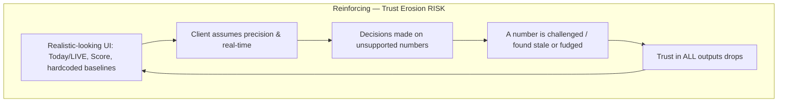
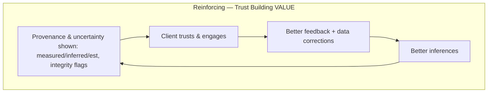
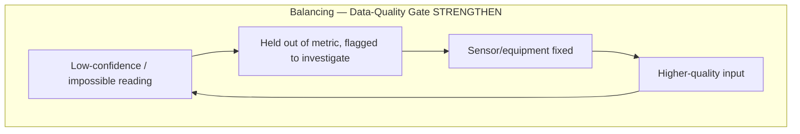

# Whole-System Architecture & Product Audit — Enerlytics Energy-Management MVP

**Repo:** `osamaalshu/EnergyManagement` (local: `~/energy-mgmt-redesign`)
**Audited at:** commit `a0d1987` (post heatmap + decomposition fixes)
**Auditor stance:** senior architect / systems thinker / energy manager / critical reviewer. Adversarial by design.
**Method:** Donella Meadows *Thinking in Systems* (stock/flows/loops) + traceability to source.

> **Evidence legend:** **[F]** fact observed in repo · **[I]** interpretation · **[D]** inferred design intent · **[P]** proposed assumption · **[R]** recommendation.
> **Confidence:** High / Medium / Low. Where I could not trace something, it says **Insufficient evidence — validation required.**

---

## 1. Executive Summary

**Current purpose (as built).** Convert ~3 years of real chiller-plant CSV telemetry (one plant, "CP1", 3 chillers + pumps, 2011-06 → 2014-04) into a static, offline-enriched dashboard: consumption/demand, COP/efficiency, CRT tariff bills + option comparison, a bill decomposition, a data-quality view, and (new) a daily-consumption heatmap. **[F, High]** — `HANDOVER.md`, `scripts/enrich_data.py`, `scripts/preprocess-csv.mjs`.

**Actual current capabilities (genuinely supported):**
- Real metered **electrical consumption & demand** (all hours). **[F, High]**
- **CRT tariff bills (Options 1/2/3 × 3 voltages)** via the enerlytics Python engine, **TS↔Python parity 0.008%**. **[F, High]**
- **COP / kW-per-ton** on physics-validated readings (now 2-hour basis + SUSPECT). **[F, High]**
- **Data-quality classification** (GOOD/SUSPECT/BAD/MISSING/IDLE) with "tag & keep, never discard." **[F, High]**
- **Bill decomposition** (structural vs operational vs efficient COP target) — *fixed this session* to reconcile. **[F, High]**
- **Daily consumption heatmap** (new). **[F, High]**

**Major architectural strengths:**
- Clean offline-enrichment seam: `CSV → preprocess/enrich → committed JSON → typed TS adapters → pages`. No backend to break; deterministic build. **[F, High]** `HANDOVER.md`.
- The tariff/physics **engine is real and parity-checked** — it is the defensible core and the commercial moat. **[F, High]**

**Major architectural risks:**
- The product is **two partially-fused systems**: a credible physics/tariff engine bolted *underneath a UX/UI demo shell that still carries generation-template artifacts and "live" framing*. They do not yet form one coherent energy-management product. **[I, High]**
- **No automated tests** around the critical transformations (tariff, COP, decomposition). `test-results/` is empty. **[F, High]**
- **Domain thresholds/baselines hardcoded in UI components.** **[F, High]**

**Major product risks (trust):**
- **Stale batch data is labeled "Today / last 24h / LIVE."** Data ends **2014-04-09**, but the dashboard shows "Today's Cooling Output / Consumption." **[F, High]**
- **A `× 10` "correction factor"** on pump specific energy with no documented physical basis. **[F, High]**
- **Hardcoded baselines (COP 5.2, pump 0.08)** presented as "Baseline" with no provenance. **[F, High]**
- **"Production vs Consumption"** framing borrowed from a generation template — a chiller plant produces no energy. **[F, High]**
- **Portfolio "Score / 100"** from a magic linear formula. **[F, Medium]**

**Overall MVP coherence:** **~5/10.** The engine is 8/10; the presentation layer drags it to ~5 because it over-claims (live, production, scores, baselines) beyond what the data supports. The gap is **trust**, not capability.

**Top five interventions (detail in §12):**
1. **P0** — Kill the "Today/LIVE/last-24h" framing; label data vintage honestly.
2. **P0** — Justify or remove the `×10` pump factor and the hardcoded 5.2 / 0.08 baselines.
3. **P0** — Re-label or remove "Production vs Consumption."
4. **P1** — Reconcile README to reality; consolidate the two anomaly systems; rename `mockPortfolioData`.
5. **P1** — Reframe the portfolio "Score"; add a units/provenance contract; add golden tests on tariff/COP/decomposition.

---

## 2. Repository & System Map

### Component / data-flow map **[F, High]**
```
hourly_data_2011..2014.csv  (raw plant telemetry, real)
        │
        ├─► scripts/preprocess-csv.mjs ─► src/data/generated/realData.json
        │        (KPIs, today's*, hourly prod/cons, breakdown, anomalies,      
        │         score, pump specific energy ×10, COP series, baselines)      
        │                                   └─► src/data/realPortfolioData.ts   
        │                                          └─► src/data/mockPortfolioData.ts  (PASS-THROUGH; misleading name)
        │
        └─► scripts/enrich_data.py ──────► src/data/generated/enrichedData.json
                 (needs ../enerlytics)       (dataQuality, physics, CRT bills,  
                                              decomposition, parity)            
                                                   └─► src/data/enrichedPortfolioData.ts
                                                          │
                  ┌───────────────────────────────────────┘
                  ▼
   App.tsx (state-routed: activePage)
     ├─ DashboardPage   (overview, "Today's", last-24h kWh/OMR)
     ├─ PortfolioPage   (score, savings %, energy breakdown, bands)
     ├─ BuildingPage    (COP chart [baseline 5.2], pump specific energy [baseline 0.08], data quality, plant physics)
     ├─ EquipmentPage   (per chiller: COP/rules; pumps/towers: series + KPIs, NO diagnostics)
     ├─ TariffPage      (KPIs, option comparison, effective rate, peak demand, HEATMAP, decomposition, diagnostic estimate)
     └─ SystemSummaryModal
```

### Dependency / trust boundaries **[F/I, High]**
- **External dependency:** the `enerlytics` Python platform (`layer2_tariff`, `blocks/block1_chiller`, `shared`) — *not vendored*; required to regenerate `enrichedData.json`. **[F]** `enrich_data.py:50-75`.
- **Trust boundary:** everything downstream of the two committed JSONs trusts them as ground truth. The UI cannot tell measured from inferred unless the data carries provenance (mostly it does not). **[I, High]**
- **Failure boundary:** if a CSV column is absent, `preprocess` coerces to `0.0` (`load`/`DictReader` default) — **missing treated as zero** in places (see §4). **[F, Medium]**

### User flow **[F, Medium]**
Landing = Dashboard. Tariff/Building/Equipment are reached by in-page navigation (cards/links), **not deep-linkable routes** (`App.tsx` `activePage` state). This is *why the heatmap "couldn't be found"* — there is no URL for the Tariff page.

### External actors
- **Real:** Netlify (static build/deploy from `main`).
- **Implied but absent:** live meter feed, API backend, multi-site portfolio, BMS. The README implies "future API integration"; none exists. **[F]**

---

## 3. Current vs Intended Behaviour

| Area | Intended (HANDOVER/engine) | Current (UI) | Evidence | Gap | Severity |
|---|---|---|---|---|---|
| Data vintage | Historical 2011–2014 batch | Shown as **"Today's"**, "last 24h", "LIVE"-style | `DashboardPage.tsx:235,253,278`; `preprocess` `latestDate` | Stale data implied current | **High** |
| Pump specific energy | kWh/m³ from CSV | Multiplied by **×10** "correction" | `preprocess-csv.mjs:876`; commit `b236aae` | Unexplained scaling | **High** |
| Efficiency baseline | Benchmark/target | Hardcoded **5.2** (COP), **0.08** (pump) | `BuildingPage.tsx:318,375,392,444`; commit `a353ea4` | Unsourced numbers as "Baseline" | **High** |
| Cooling output | Thermal cooling (tons) | Labeled **"Production"** vs "Consumption" | `preprocess-csv.mjs:290-310` | Generation-template mislabel | **High** |
| Bill decomposition | Efficient-reference split | *Fixed:* physics-expected COP baseline, reconciles | `enrich_data.py compute_decomposition` (this session) | Resolved | Resolved |
| Tariff "premium" | TOU vs flat | *Fixed:* signed effect (was clamped 0) | `enrich_data.py` (this session) | Resolved | Resolved |
| Physics in bill | Diagnostic estimate | *Fixed:* separate "modeled · est." panel | `TariffPage.tsx` (this session) | Resolved | Resolved |
| Portfolio score | Efficiency index | "Score / 100" via magic formula | `preprocess-csv.mjs:736`; `PortfolioPage.tsx:218` | False precision | Medium |
| Anomalies | Physics rules (R-CH) | **Two** systems: rolling-threshold *and* physics | `preprocess-csv.mjs:512-635` vs `enrich_data.py` rules | Duplicate/competing | Medium |
| Pumps/towers | No rules (missing signals) | Show series + KPIs, no diagnostics | `HANDOVER.md` "Rules not applicable"; `EquipmentPage.tsx:65-68` | Honest, but capability implied by equipment page | Medium |
| Docs | Engine-integrated platform | README still says "mock data", "Savings" page, widgets | `README.md` vs `HANDOVER.md` | Doc contradicts build | Medium |
| Naming | Real data | File named `mockPortfolioData.ts` | `src/data/mockPortfolioData.ts` | Misleading | Low |
| Scope | One plant (CP1) | "Portfolio", "Building A", buildingCount | `PortfolioPage`, `preprocess` portfolioMeta | Multi-site implied | Medium |

---

## 4. System Boundary Definition

**Inside the MVP boundary (defensible):** offline enrichment of one plant's historical CSV; CRT bill computation; COP/kW-per-ton on validated readings; data-quality classification; bill decomposition vs an efficient COP target; static visualization.

**Outside the boundary (currently implied, not real):** real-time/live data; multi-site portfolio; pump & cooling-tower fault diagnostics; condenser-fouling (R-CH-02); any API/backend; operator control/actuation.

| Capability | Class | Evidence |
|---|---|---|
| Electrical kW / kWh | **Measured** | CSV `Total_Chiller_kW`, `CP_TotalChilledWaterPump_kW` **[F]** |
| Chilled-water temps / flow | **Measured (when sensor valid ~22–50% of hrs)** | `classify_chiller_rows` **[F]** |
| COP / cooling load | **Inferred** (from temps+flow; bounded) | `enrich_data.py`; `block1_chiller` **[F]** |
| Cooling load for invalid-sensor hours | **Cannot reliably know** | sensor coverage; "tag & keep" **[F]** |
| Wet-bulb / condenser / head pressure | **Not observed** → no R-CH-02 / R-PU / R-CT rules | `HANDOVER.md` **[F]** |
| Real-time state | **Cannot know** (batch, ends 2014-04) | data range **[F]** |
| CRT bill | **Computed** (deterministic, parity-checked) | `enrich_data.py`, `tariffEngine.ts` **[F]** |
| "Recommendations" | **Currently none explicit**; "savings potential" is an *inference* | `portfolioMeta.savingsPotentialPercent` **[F]** |

**Boundary violations to flag (UI acts as if it knows more than it does):**
1. **Implies real-time** from batch data ("Today/LIVE"). **[F, High]**
2. **Implies equipment diagnostics** for pumps/towers it cannot diagnose (no wet-bulb/head signals). **[I, Medium]**
3. **Presents inferred/hardcoded baselines as measured "Baseline."** **[F, High]**
4. **Treats absent CSV columns as `0.0`** (coercion) rather than "missing." **[F, Medium]** `preprocess-csv.mjs` load loop.
5. **Applies the 2025 CRT tariff to 2011–2014 load** — an "as-if-today's-prices" inference presented as the bill. Defensible *if stated*; currently unstated. **[F, High]** `enrich_data.py:TARIFF_YEAR=2025`.

---

## 5. Assumption Register

| ID | Assumption | Location | Evidence | Risk if wrong | Validation | Status |
|---|---|---|---|---|---|---|
| A1 | Latest data day = "Today" | `DashboardPage` "Today's*" | [F] | Client thinks data is live; decisions on 11-yr-old day | Label vintage | **Contradicted by UI** |
| A2 | Pump specific energy needs `×10` | `preprocess:876` | [F] | Wrong kWh/m³ shown vs baseline | Derive unit conversion from flow units | **Explicit, unvalidated (risky)** |
| A3 | COP baseline = 5.2 | `BuildingPage:318/375` | [F] | Plant judged vs arbitrary line | Source from nameplate/benchmark/best | **Implicit, risky** |
| A4 | Pump baseline = 0.08 kWh/m³ | `BuildingPage:392/444` | [F] | Same | Source it | **Implicit, risky** |
| A5 | Cooling "Production" comparable to electrical "Consumption" | `preprocess:290-310` | [F] | Reads like free energy (thermal≈3–6× elec) | Relabel | **Contradicted by domain** |
| A6 | 1 ton = 3.517 kW thermal | `preprocess:298,309`; physics | [F] | Standard refrigeration ton | n/a (correct) | **Explicit, validated** |
| A7 | COP physical bounds [0.5, 12]; min ΔT 1°C | `block1_chiller/constants` | [F] | Reasonable engineering bounds | Domain confirm | **Implicit, reasonable** |
| A8 | Oman weekend = Fri/Sat; UTC+4 no DST | `bill_decomposer`, `enrich` | [F] | Wrong TOU band assignment | Confirmed correct for Oman | **Explicit, validated** |
| A9 | 2025 CRT rates applied to 2011–2014 load | `enrich_data.py:TARIFF_YEAR=2025` | [F] | Bill is hypothetical, not historical | State it in UI | **Explicit but undisclosed in UI** |
| A10 | Efficiency target = demonstrated-best COP (this session) | `enrich_data.py:resolve_target_cop` | [F] | Self-referential until nameplate loaded | Load manufacturer COP | **Explicit, reasonable (MVP)** |
| A11 | Portfolio score = 100−(kWperTon−0.3)×120 | `preprocess:736` | [F] | Arbitrary anchor/slope → false precision | Define index basis | **Explicit, unvalidated** |
| A12 | `avgCoolingTons` default 200 for cost calc | `preprocess:545` | [F] | Fabricated cost magnitude when missing | Require real tons | **Implicit, risky** |
| A13 | Missing CSV column → 0.0 | `preprocess` load | [F] | Missing read as real zero | Distinguish null vs 0 | **Implicit, risky** |
| A14 | Single plant ("CP1") but "portfolio"/"Building A" | `preprocess`, `PortfolioPage` | [F] | Implies multi-site scale | Align copy to one plant | **Implicit** |

**Proposed assumptions to make explicit (testable, MVP-appropriate) [P]:** the bill is *"computed at 2025 CRT rates"* (A9); the baseline is *"target X from {nameplate|best-month|benchmark}"* (A3/A4); data is *"latest available period: <date>"* (A1). Each is falsifiable against a stated source.

---

## 6. Feature Justification Matrix

| Feature | User problem | Decision supported | Requirement? | Input class | Assumptions | MVP fit | Recommendation |
|---|---|---|---|---|---|---|---|
| CRT bill + Option comparison | "Am I on the cheapest tariff?" | Tariff option choice | Yes (core) | Computed | A6,A8,A9 | ✅ | **Retain** (disclose A9) |
| Bill decomposition (fixed) | "What of my bill is avoidable?" | Efficiency investment | Yes | Inferred+computed | A10 | ✅ | **Retain** |
| Diagnostic estimate (physics) | "Where's the fault cost?" | Maintenance triage | Yes | Inferred (modeled) | A7,A10 | ✅ | **Retain** |
| COP / kW-per-ton charts | "How efficient is the plant?" | Efficiency tracking | Yes | Inferred | A3,A7 | ✅ | **Retain** (fix A3 baseline) |
| Data quality + integrity flag | "Can I trust the numbers?" | Sensor/equipment investigation | Yes | Measured/derived | — | ✅ | **Retain** (added this session) |
| Consumption heatmap | "When do we burn most?" | Load-shift targeting | Yes | Measured | — | ✅ | **Retain** |
| Peak demand chart | "What drives capacity charges?" | Demand management | Yes | Measured | A8 | ✅ | **Retain** |
| "Today's" cards / last-24h | (none — data is old) | None real | No | Measured but mis-timed | A1 | ❌ | **Redesign** → "latest period" |
| Production vs Consumption | unclear | None defensible | No | Inferred(thermal) vs measured | A5 | ❌ | **Redesign/Remove** |
| Pump specific energy (×10) | "Pump efficiency?" | Pump ops | Maybe | Measured ×fudge | A2,A4 | ⚠ | **Investigate** (fix ×10) |
| Portfolio Score /100 | "One-glance health" | Soft prioritization | Weak | Derived heuristic | A11 | ⚠ | **Simplify** → index, or lead with savings% |
| Rolling-threshold anomaly | "Anomalies" | Investigation | Partial | Derived | A12 | ⚠ | **Merge** into physics rules |
| Energy breakdown donut | "Where does power go?" | Allocation | Yes | Measured % | — | ✅ | **Retain** |
| Pumps/Towers equipment pages | "Per-equipment view" | Ops detail | Partial | Measured series, no diagnostics | — | ⚠ | **Simplify** (state "no fault rules yet") |
| Draggable widget layout (README) | customization | None | No | — | — | ❓ | **Investigate** (does it still exist?) — *Insufficient evidence* |

---

## 7. End-to-End Traceability (representative chains)

- **"Today's Consumption" (kWh)** → `DashboardPage.tsx:253-263` → `last24ConsumptionKwh` (`hourlyProductionConsumption.slice(-24)`) → `preprocess-csv.mjs:294-310` `todayRows = rows where date == latestDate (2014-04-09)` → raw CSV. **Assumption A1 (broken). No test. No requirement.** **[F, High]**
- **"Baseline 5.2" (COP chart)** → `BuildingPage.tsx:318,375` `ReferenceLine y={5.2}` → **hardcoded literal**, no data source, commit `a353ea4` ("replace averages"). **Broken traceability to a source of truth.** **[F, High]**
- **Pump specific energy** → `BuildingPage` `getPumpSpecificEnergySeries` → `preprocess-csv.mjs:876` `(avgPumpKw/avgTotalFlow) * 10` → CSV. **The `*10` has no traced justification** (commit `b236aae` calls it "correction factor"). **[F, High]**
- **CRT bill total** → `TariffPage` `monthlyBills` → `tariffEngine.ts` / `enrich_data.py` `calculate_crt_bill` → CSV intervals + `config(TARIFF_YEAR=2025)` → **parity-checked** vs Python. **Good chain; A9 undisclosed.** **[F, High]**
- **Operational (correctable) OMR** → `TariffPage` table → `enrich_data.py compute_decomposition` → efficient reference at `target_cop` (`resolve_target_cop`) → physics monthly COP → 2-hour blocks. **Traceable & reconciles (fixed).** **[F, High]**

---

## 8. Feedback-Loop Analysis


**R1 — Trust-erosion (reinforcing, RISK).** Variables: perceived-precision, unsupported-claims, discovery-events. Evidence: A1, A2, A3, A4, A5, A11. Delay: trust collapses *after* a client catches one fabricated number — then doubts the good ones (parity-checked tariff). **Intervention:** provenance + vintage labels; remove fudges. **Signal of improvement:** every client-facing number has a traceable source; zero "magic" literals in UI.


**R2 — Trust-building (reinforcing, VALUE).** Evidence: the integrity "Investigate" flag, the "diagnostic estimate · modeled · est." panel, the data-quality card (this session). **Intervention:** extend provenance to every metric. **Signal:** users act on flags; data quality % rises over pilots.


**B1 — Data-quality gate (balancing, STRENGTHEN).** Evidence: `classify_chiller_rows` tag-and-keep; integrity flag. Currently partial — energy still uses 100% incl. bad (correct), but several derived numbers (score, anomaly cost) ignore confidence. **Intervention:** propagate confidence into score/anomaly; block precision the input can't support.

---

## 9. Architecture Findings

**F1 — "Today/LIVE" on 2014 batch data.** Evidence: `DashboardPage.tsx:235,253,278`. Why it matters: single biggest trust risk; a pilot client will notice. Root cause: UX shell designed for live data; merged onto historical CSV. Consequence: false real-time claim. **[R]** Replace with "Latest available period — <month/year>"; remove "LIVE." Effort: S. Urgency: **P0**. Confidence: High.

**F2 — `×10` pump factor.** Evidence: `preprocess-csv.mjs:876`, commit `b236aae`. Why: a hidden multiplier on a physical quantity is indefensible unless it's a named unit conversion. Root cause: values didn't match the (also hardcoded) 0.08 baseline → scaled to fit. Consequence: wrong kWh/m³. **[R]** Derive the real flow-unit conversion (L/s vs m³/h vs m³/s) and document; if it isn't a conversion, remove. Effort: S. Urgency: **P0**. Confidence: High that it exists; **Insufficient evidence** on whether ×10 is a legit conversion — *validation required*.

**F3 — Hardcoded baselines 5.2 / 0.08.** Evidence: `BuildingPage.tsx:318,375,392,444`. Why: presented as "Baseline" with no source; plant is judged against an arbitrary line. Root cause: commit `a353ea4` replaced computed averages with literals "for a cleaner chart." **[R]** Source from {nameplate | best-period | published benchmark}; label provenance; move out of the component into config/data. Effort: M. Urgency: **P0**. Confidence: High.

**F4 — "Production vs Consumption."** Evidence: `preprocess-csv.mjs:290-310`. Why: chillers consume; "production" = thermal cooling kWh, ~3–6× the electrical input, so the chart can read like energy is being created. Root cause: generation/solar UX template. **[R]** Relabel "Cooling delivered (thermal) vs Electrical input," or drop the dual series and show COP. Effort: S. Urgency: **P0**. Confidence: High.

**F5 — No tests on critical math.** Evidence: empty `test-results/`; no `*.test.*`. Why: tariff/COP/decomposition can silently regress. Root cause: demo-speed. **[R]** Golden/parity tests on `tariffEngine`, COP, decomposition reconciliation (delegate test authoring per workflow). Effort: M. Urgency: **P1**. Confidence: High.

**F6 — Two anomaly systems.** Evidence: rolling-threshold `computeAnomalyData` (`preprocess:512-635`) vs physics R-CH rules (`enrich_data.py`). Why: competing definitions of "anomaly"/"inefficiency cost"; unclear authority; `avgCoolingTons=200` default fabricates cost. Root cause: pre-merge statistical detector survived the physics-engine merge. **[R]** Make physics the single source; retire or clearly demote the rolling detector. Effort: M. Urgency: **P1**. Confidence: High.

**F7 — Portfolio Score magic formula.** Evidence: `preprocess:736`, `PortfolioPage:218`. **[R]** Reframe as "Efficiency Index" with documented anchors, or lead with the defensible 13% savings-potential. Effort: S. Urgency: **P1**. Confidence: Medium.

**F8 — README contradicts the build.** Evidence: `README.md` ("mock data", "Savings" page, draggable widgets) vs `HANDOVER.md`/reality. **[R]** Rewrite README from HANDOVER; delete stale claims. Effort: S. Urgency: **P1**. Confidence: High.

**F9 — `mockPortfolioData.ts` holds real data.** Evidence: file is a pure re-export of `realPortfolioData`. **[R]** Rename to `portfolioData.ts`; update imports. Effort: S. Urgency: **P2**. Confidence: High.

**F10 — Domain logic/thresholds in UI + state-routing.** Evidence: baselines in `BuildingPage`; `ANOMALY_THRESHOLDS` in preprocess; `App.tsx` `activePage` (no routes → not deep-linkable, the "can't find the heatmap" symptom). **[R]** Move thresholds to a config/contract; adopt real routes. Effort: M. Urgency: **P2**. Confidence: High.

**F11 — Missing-as-zero coercion.** Evidence: `preprocess` float-coerces absent columns to `0.0`. Why: a missing sensor reads as a real zero, skewing sums/averages. **[R]** Distinguish null from 0 in the contract. Effort: M. Urgency: **P2**. Confidence: Medium.

---

## 10. Overengineering vs Underengineering

**Overengineering (relative to a one-plant MVP):**
- **Multi-resolution everything** (hourly/daily/weekly/monthly/yearly selectors across many charts; `comparisonsByResolution`, `*ByResolution`) for one plant of historical data — heavy surface for limited decisions. **[I, Medium]** → simplify default views.
- **3 voltages × 3 options** fully computed though the site is a known voltage — fine to keep (cheap), but the UI exposes all permutations. **[I, Low]**
- **Draggable/resizable widget layout** (README "edit mode") — customization infra with no MVP decision behind it. **[F→I]** *Insufficient evidence whether still wired* — investigate/remove.

**Underengineering (relative to the trust the product claims):**
- **Domain thresholds hardcoded in components** (5.2, 0.08, anomaly thresholds). **[F, High]**
- **No provenance/units contract** between JSON and UI — UI can't distinguish measured/inferred/assumed. **[I, High]**
- **No tests** on financial/physics math. **[F, High]**
- **Silent fallbacks** (`avgCoolingTons=200`, missing→0). **[F, Medium]**
- **No data-vintage/freshness field** surfaced. **[F, High]**

---

## 11. Contradictions & Open Questions

- **UI vs data:** "Today/LIVE" vs 2011–2014 batch. **[F]**
- **Docs vs impl:** README "mock data / Savings page / widgets" vs real-data 5-page engine. **[F]**
- **Domain vs code:** "Production" (code) vs a chiller plant that produces nothing (domain). **[F]**
- **Naming vs reality:** `mockPortfolioData` holds real data. **[F]**
- **Tests vs behavior:** none exist to protect parity. **[F]**
- **Open (insufficient evidence):** Is the `×10` a real unit conversion? Is the widget edit-mode still present? Are pump/tower KPIs (`getPumpKPIsForResolution`, tower temps) from real sensors and labeled as such? — *validation required.*

---

## 12. Prioritized Intervention Plan

### P0 — Trust / correctness (block the pilot)
1. Remove "Today/LIVE/last-24h" framing → "Latest available period: <date>"; add a global data-vintage banner. (F1)
2. Resolve the `×10` pump factor — document the unit conversion or remove it. (F2)
3. Source or remove hardcoded baselines 5.2 / 0.08; label provenance. (F3)
4. Re-label / remove "Production vs Consumption." (F4)
5. Disclose A9 ("bill computed at 2025 CRT rates") wherever a bill is shown.

### P1 — MVP coherence
6. Rewrite README from HANDOVER. (F8)
7. Consolidate anomaly logic to the physics rules; retire rolling-threshold + `avgCoolingTons=200`. (F6)
8. Reframe portfolio Score as an index / lead with savings-potential. (F7)
9. Rename `mockPortfolioData` → `portfolioData`. (F9)
10. Align scope language to a single plant (drop "Building A"/portfolio implications) **or** state "single-site pilot."

### P2 — Maintainability / scale
11. Golden + parity tests on tariff/COP/decomposition. (F5)
12. Move thresholds/baselines to a config/data contract; add provenance+units fields. (F10/F11)
13. Real routing (deep-linkable pages).

### P3 — Future (document, don't build)
14. Live ingestion; multi-site; wet-bulb/head signals to unlock R-CH-02 / R-PU / R-CT; manufacturer nameplate COP feed; per-facility thresholds.

---

## 13. Proposed Target Architecture (smallest defensible)

Keep the seam that works; add a thin **provenance/contract** layer; strip template artifacts.

| Concern | Current | Proposed | Reason | Necessary before next pilot? |
|---|---|---|---|---|
| Data contract | Untyped JSON → TS `as` casts | A versioned `dataContract` with per-field `{value, unit, provenance: measured\|inferred\|assumed\|computed, asOf}` | UI can show truth honestly | **Yes** (at least vintage + provenance on headline numbers) |
| Baselines/thresholds | Hardcoded in components/preprocess | `config/benchmarks.ts` (sourced, labeled) | Traceability, per-site override | **Yes** |
| Anomaly | Two systems | Physics rules only | One defensible source | Recommended |
| Naming | `mockPortfolioData` | `portfolioData` | Honesty | Low cost |
| Routing | `activePage` state | Real routes | Deep-link/shareable | P2 |
| Tests | none | golden/parity | Regression safety | Recommended |

Files most affected: `DashboardPage.tsx`, `BuildingPage.tsx`, `preprocess-csv.mjs`, `realPortfolioData.ts`, `README.md`, new `config/benchmarks.ts`. Migration risk: **Low–Medium** (mostly labeling + relocating literals; the engine stays). Tests required: tariff parity, decomposition reconciliation, COP bounds, "no NaN/Infinity in any series."

---

## 14. Questions Requiring Validation

**Answerable from code (I can do):** rename mock→real; relabel Today/Production; move baselines to config; reconcile README; consolidate anomaly.

**Answerable from existing docs:** the enerlytics rule catalog (R-CH-02/R-PU/R-CT signal needs) — in `HANDOVER.md`.

**Require founder/domain validation:**
- **The `×10` pump factor** — is it a real flow-unit conversion, and what are the CSV flow units? (A2) — *blocking.*
- **COP baseline 5.2 and pump baseline 0.08** — what is the intended source (nameplate? design? code?)? (A3/A4)
- **Tariff vintage** — is showing 2011–2014 load at 2025 CRT rates the intended "what-if-today" framing? (A9)
- **Portfolio score** — is a single 0–100 number wanted, and on what basis? (A11)
- **Efficiency target** — confirm "demonstrated-best, then nameplate when loaded." (A10)

**Require client / real operational data:** wet-bulb, condenser, pump head → to unlock the missing diagnostics; a live feed → to legitimately say "today/live."

---

## Final Decision Framework

1. **One coherent system?** **No — two partially-fused systems.** A credible parity-checked physics/tariff **engine** under a **UX shell** that still carries generation-template framing and live-data claims. **[I, High]**
2. **Does architecture reflect the intended energy product?** **Partially.** The enrichment seam and engine do; the presentation layer over-claims. **[I]**
3. **Genuinely supported:** CRT bills + option comparison, COP/efficiency on validated data, data-quality, the (fixed) decomposition + diagnostic estimate, consumption heatmap, demand/peak, energy breakdown.
4. **Implied but unsupported:** real-time/"today", pump/tower diagnostics, "production", hardcoded baselines as truth, multi-site portfolio, the score's precision, the `×10` pump value.
5. **MVP should STOP:** claiming live/today; the `×10` fudge; unsourced baselines; production-vs-consumption; dual anomaly logic; false-precision score.
6. **Do more clearly:** data vintage, provenance (measured/inferred/assumed), single-plant scope, uncertainty, tariff-year basis.
7. **Validate before pilot:** `×10` factor, baselines 5.2/0.08, 2025-tariff-on-historical-load, target-COP basis, "today" data policy.
8. **Debt loops:** UI-first templated framing + no tests + thresholds-in-UI → patch-on-patch (R1, F10).
9. **Trust loops to grow:** provenance/uncertainty surfacing (R2, B1) — already seeded this session; extend it.
10. **Smallest defensible architecture:** keep `CSV → preprocess/enrich → committed JSON → typed adapters → pages`; add a **provenance+units+vintage contract**; centralize sourced baselines; one anomaly source (physics); honest labels. The engine stays; the shell tells the truth.

---

### Net verdict
The **engine is real and defensible** — parity-checked tariffs, sound physics, and (now) an honest decomposition and data-quality story. The **risk is entirely in the presentation layer over-claiming** what the data supports: live/today framing, a hidden ×10, unsourced baselines, and generation-template language. None of these require re-architecting — they require **telling the truth about provenance, vintage, and uncertainty.** Fix the four P0 items and this becomes a pilot-credible MVP.

*Audit complete. No production logic was modified to produce this document.*
