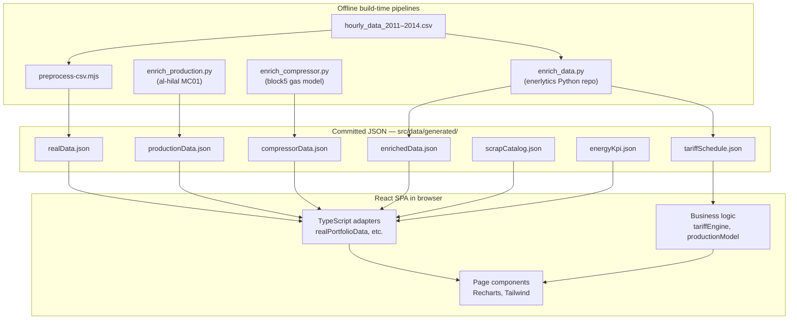

# Enerlytics — Repository & Software Overview

Your workspace is **`OQ Accelerator MVP`**, which contains a single application: **`energy-dashboard`** — a React app deployed as a static site (Netlify). The Git repo lives inside `energy-dashboard` (`EnergyManagement` on GitHub). Everything below refers to that project unless noted.

---

## What This Software Is

**Enerlytics** is an industrial **energy and operations analytics platform** aimed at Gulf-region facilities (Oman-centric: costs in **OMR**, electricity modeled with **APSR CRT** tariff rules).

It serves three audiences in one UI:

| Audience | What they get |
|----------|----------------|
| **Energy / facility managers** | Portfolio KPIs, chiller plant efficiency (COP, kW/ton), pump specific energy, anomalies, tariff bills |
| **Production / plant managers** | Extrusion line scheduling, delivery risk (OTIF), scrap prioritization, factory energy intensity |
| **Pilot stakeholders (OQ / gas)** | Gas compressor efficiency monitoring with physics-based diagnostics |

It is an **MVP / accelerator demo**: polished UX on **precomputed JSON data**, with explicit labeling so demo/scenario data is never mistaken for live plant feeds. The architecture is deliberately built so real APIs and live sensors can replace JSON adapters later without rewriting the UI.

---

## High-Level Architecture

There is **no backend server** in this repo. The app is a **static Single Page Application (SPA)**:



**Build flow:** `verify-provenance.mjs` → TypeScript compile → Vite bundle → `dist/` → Netlify.

---

## Three Product Domains in One App

### 1. Cooling Plant Portfolio (Chiller Plant 1 — CP1)

- **Real historical data:** ~25,053 hourly readings from **June 2011 → April 2014**
- **Assets:** 3 chillers, cooling towers, pumps
- **Analytics:** COP, system ΔT, flow, kW/ton, pump specific energy (kWh/m³), baseline deviation, performance bands vs sector
- **Physics engine output:** diagnostic rules with OMR-priced impact (e.g. low COP, peak TOU waste)
- **Tariff engine:** full Oman CRT bill decomposition (BST, distribution, capacity, supply, VAT) at 33kV / 11kV / 0.415kV

### 2. Analyse Workspace (Nizwa Plastic Factory — MC01 extrusion)

Manufacturing decision tools built around extrusion line **EXT-01**:

| Page | Purpose |
|------|---------|
| **Analyse Hub** | "What do I do today?" — delivery verdict, scrap verdict, energy intensity |
| **Production Planner** | Order sequencing, Monte Carlo OTIF, time-of-use lever vs CRT bands |
| **Delivery View** | Orders at risk, finish-date confidence, recommended schedule changes |
| **Scrap Focus** | Pareto scrap analysis, recoverable savings, product drill-down |
| **Validation Lab** | Simulated plant telemetry (SimPy digital twin preview) |

Order books are **scenario-generated in the browser** — not live ERP data — and the UI says so explicitly.

### 3. Gas Compressor Pilot (OQ-GN Nizwa)

- **Synthetic data** from the enerlytics `block5_gas_compressor` model
- KPIs: polytropic/isentropic efficiency, specific power, compression ratio
- Interactive schematic (suction → compressor → discharge)
- Labeled as **pilot preview** throughout

---

## Repository Structure

```
OQ Accelerator MVP/
└── energy-dashboard/          ← the actual Git repo & application
    ├── src/                   ← React application source
    ├── scripts/               ← offline data pipelines (Node + Python)
    ├── public/                ← static assets (logos, favicon)
    ├── docs/                  ← product requirements (Analyse PRD)
    ├── Branding/              ← brand PDF + icon assets
    ├── calc/                  ← Jupyter notebook for CRT tariff exploration
    ├── dist/                  ← production build output
    ├── test-results/          ← Vitest run metadata
    ├── .cursor/rules/         ← Cursor AI guardrails for this project
    └── *.md                   ← architecture audits, handover, trust plans
```

### `src/` — Application Code

| Folder | Role |
|--------|------|
| **`components/`** | All page-level views *and* shared UI (24 files). There is no separate `pages/` folder despite what README still says. |
| **`data/`** | Raw CSVs, generated JSON, and thin TypeScript adapters that import JSON |
| **`lib/`** | Business logic: tariff engine, production scheduler, navigation tree, energy placeholders |
| **`types/`** | TypeScript contracts for portfolio, production, and compressor domains |
| **`App.tsx`** | Root router + theme + drill-down state |
| **`main.tsx`** | React 19 entry point |

### `src/data/` — Data Layer

**Raw source (~12.6 MB):**

- `hourly_data_2011.csv` … `hourly_data_2014.csv` — real chiller plant telemetry

**Generated JSON (committed, consumed at build time):**

| File | Produced by | Used for |
|------|-------------|----------|
| `realData.json` (~3 MB) | `preprocess-csv.mjs` | Time series, KPIs, anomalies, baselines, comparisons |
| `enrichedData.json` | `enrich_data.py` | Data quality, physics rules, CRT bills, bill decomposition |
| `tariffSchedule.json` | `enrich_data.py` | 2025 APSR CRT rate schedule for runtime TS engine |
| `productionData.json` | `enrich_production.py` | SKU catalog, line rates, plant simulation output |
| `compressorData.json` | `enrich_compressor.py` | OQ-GN compressor pilot series + findings |
| `scrapCatalog.json` | External scrap analysis | Per-product reject rates, shift records |
| `energyKpi.json` | Factory bills ÷ MC01 production | Monthly kWh/kg intensity |

**TypeScript adapters** (thin loaders):

- `realPortfolioData.ts` — main cooling plant adapter; sets `datasetMeta.mode = 'demo'`
- `mockPortfolioData.ts` — **misleading name**: it re-exports `realPortfolioData` (legacy import path)
- `enrichedPortfolioData.ts` — physics, tariff, decomposition, parity results
- `productionData.ts`, `compressorData.ts`, `scrapCatalog.ts`, `energyKpi.ts`

### `scripts/` — Offline Pipelines

| Script | Command | What it does |
|--------|---------|--------------|
| `preprocess-csv.mjs` | `npm run preprocess` | CSV → `realData.json` (KPIs, time series, COP, pump SE, anomalies, tariff hourly data) |
| `enrich_data.py` | `npm run enrich` | Runs external **enerlytics** Python repo over same CSVs → `enrichedData.json` + `tariffSchedule.json`; includes TS↔Python parity check |
| `enrich_production.py` | manual | Reads **al-hilal-mc01-analysis** repo → `productionData.json` |
| `enrich_compressor.py` | manual | Runs enerlytics `block5_gas_compressor` → `compressorData.json` |
| `verify-provenance.mjs` | `npm run verify:provenance` | **Build gate** — checks provenance propagation, tariff sync, forbidden UI strings |

External Python repos are **not vendored** — you point to them via env vars (`ENERLYTICS_REPO`, `AL_HILAL_REPO`).

### Root Documentation

| File | Purpose |
|------|---------|
| `README.md` | Dev setup, npm scripts, deployment (partially stale vs current app scope) |
| `HANDOVER.md` | Integration handover: Python engine alignment, parity results (0.008% max diff) |
| `WHOLE_SYSTEM_AUDIT.md` | Adversarial audit: strengths, trust risks, remediation status |
| `FULL_SYSTEM_CODEBASE_INSPECTION.md` | System interaction map, duplicate engines, dead code inventory |
| `PROVENANCE_FRESHNESS_CONTRACT_PLAN.md` | Trust contract: data mode labeling, freshness chips |
| `SYSTEM_TRUST_SEAMS_PLAN.md` | Plan to unify tariff authority and propagate metadata to UI |
| `docs/ANALYSE_PRD.md` | Product requirements for Analyse workspace features |
| `CHANGES.log` | Running changelog of recent work |

---

## Frontend Architecture

### Tech Stack

- **React 19** + **TypeScript** + **Vite 7**
- **Tailwind CSS** (dark mode via `class` strategy, Enerlytics brand palette)
- **Recharts** for charts
- **xlsx** for Excel export, **html2canvas** + **jspdf** for PDF export
- **Vitest** for unit tests (Node environment, no jsdom)
- Deployed on **Netlify** (Node 20, SPA redirects, security headers)

### Navigation Model

There is **no React Router**. Navigation is **React state** in `App.tsx`:

```tsx
function App() {
  const [activePage, setActivePage] = useState<ActivePage>('dashboard');
  const [sidebarOpen, setSidebarOpen] = useState<boolean>(() => getDefaultSidebarState());
  const [theme, setTheme] = useState<ThemeMode>(() => getPreferredTheme());

  // Drill-down state: Portfolio → Site → Subsystem → Equipment
  const [selectedSiteId, setSelectedSiteId] = useState<string | null>(null);
  const [selectedSubsystemId, setSelectedSubsystemId] = useState<string | null>(null);
  const [selectedEquipmentId, setSelectedEquipmentId] = useState<string | null>(null);
```

**Hierarchy:**

```
Overview (dashboard)
Portfolio (portfolio)
  └── Site
        └── Subsystem
              └── Equipment

Tariff (tariff) — linked from Overview, not in sidebar

Analyse workspace:
  ├── Analyse Hub (analyse)
  ├── Delivery View (delivery)
  ├── Production Planner (production)
  └── Scrap Focus (scrap)

Validation Lab (plant)
```

Sites are defined in `portfolioNav.ts` — cooling buildings from portfolio data plus the compressor as its own site:

```ts
// Unified navigation model: Portfolio → Site → Subsystem → Equipment.
//
// Cooling sites come from the portfolio dataset; their subsystems are derived
// from each unit's `type` (the grouping was always implicit in the data). The
// OQ-GN compressor is a *different site* (gas, pilot/synthetic), so it joins the
// portfolio as its own site with a single "Compressed gas" subsystem — honest
// placement, not folded into a cooling building. Compressor leaves route to the
// dedicated CompressorPage; cooling leaves route to the generic EquipmentPage.
```

### Key Page Components

| Component | What it renders |
|-----------|-----------------|
| `DashboardPage` | Executive overview: KPIs, last-24h chart, warnings, notifications |
| `PortfolioPage` | Multi-site cards, score, savings %, performance scatter |
| `BuildingPage` | Site-level: COP charts, pump SE, data quality, physics diagnostics |
| `SubsystemPage` | Equipment grid for a subsystem |
| `EquipmentPage` | Per-unit time series, chiller physics, anomaly panel |
| `TariffPage` | CRT bills, voltage options, decomposition, consumption heatmap |
| `CompressorPage` | Gas compressor pilot with schematic and findings |
| `AnalyseHubPage` | Decision dashboard linking to planner/delivery/scrap |
| `ProductionPlannerPage` | Interactive order scheduler + Monte Carlo |
| `DeliveryViewPage` | OTIF forecast and orders-at-risk table |
| `ScrapAnalyzerPage` | Pareto scrap analysis with product drill-down |
| `PlantTelemetryPage` | Simulated plant power trace |

**Shared UI:** `Sidebar`, `TopBar`, `Breadcrumb`, `Provenance` (freshness chips), `ScenarioBanner`, `AnomalyPanel`, `ConsumptionHeatmap`, `ChillerPlantSchematic`, `ExportExcelButton`, `SystemSummaryModal`.

### Business Logic (`src/lib/`)

| Module | Role |
|--------|------|
| `tariffEngine.ts` | TypeScript CRT tariff engine — recomputes bills client-side from hourly kW/kWh using `tariffSchedule.json` |
| `productionModel.ts` | In-browser order scheduling, Monte Carlo OTIF, setup times, energy intensity |
| `portfolioNav.ts` | Unified site/subsystem/equipment navigation tree |
| `energyPlaceholder.ts` | Deterministic placeholder kWh/kg for scrap charts (awaiting sub-metering) |
| `datasetFreshness.ts` | Derives "live" mode from `DatasetMeta` + 6h freshness window |
| `performanceBands.ts` | Exceeded / Average / Lower band styling |

---

## Data Trust & Provenance Model

A core design principle: **never misrepresent data origin**. The `DataMode` type drives UI labeling:

```ts
/**
 * Where the dashboard's data comes from, as a product environment:
 *  - `demo`       polished sample dataset used to present the intended UX
 *  - `historical` a real but non-current dataset (show "Latest available · <date>")
 *  - `live`       a real current feed (may show "Live" only if also fresh)
 */
export type DataMode = 'demo' | 'historical' | 'live';

export interface DatasetMeta {
  /** ISO date (YYYY-MM-DD) of the latest real reading. */
  asOf: string;
  /** ISO date of the earliest real reading. */
  coverageStart: string;
  /** ISO date the underlying JSON was prepared (build/process date). */
  generatedAt: string;
  mode: DataMode;
}
```

| Data area | What's real | What's demo/assumed | UI label |
|-----------|-------------|---------------------|----------|
| Chiller portfolio | Real 2011–2014 CSV | `mode: 'demo'` for polished UX | "Demo data" chip |
| Tariff bills | Engine output from real load | 2025 rates applied to 2011–14 load | Tariff basis disclosure |
| Compressor | Physics model structure | Fully synthetic time series | "Pilot preview · synthetic data" |
| Production/Delivery | Real SKU catalog & rates | Order book generated in UI | Scenario banner |
| Scrap | Real shift-record catalog | kWh/kg is placeholder | Real/Illustrative toggle |
| Validation Lab | SimPy engine output | Entire trace simulated | "simulated" badge |

The build gate (`verify-provenance.mjs`) enforces that provenance metadata propagates to UI components and that tariff schedule versions stay in sync.

---

## Domain Concepts Glossary

| Term | Meaning |
|------|---------|
| **Portfolio** | Collection of sites with aggregate score and savings potential |
| **Site / Building** | Physical facility (CP1 chiller plant or compressor station) |
| **Subsystem** | Plant area: Cooling (HVAC) or Compressed gas |
| **Equipment** | Leaf assets: chillers, towers, pumps, compressor CS-01 |
| **COP / kW/ton** | Chiller efficiency metrics |
| **CRT / APSR** | Oman Commercial Retail Tariff electricity pricing |
| **Performance band** | Exceeded / Average / Lower vs sector benchmark |
| **Physics rules** | Diagnostic engine findings priced in OMR |
| **OTIF** | On-time-in-full delivery forecast |
| **Scrap / reject** | Material loss; `bestRejectOwn` = product's own P25 benchmark |
| **kWh/kg** | Factory-wide energy intensity (bills ÷ production kg) |
| **Changeover** | Family change (3h) vs diameter change (0.5h) setup cost |

---

## Build, Test & Deploy

```bash
npm run dev          # Vite dev server → http://localhost:5173
npm run build        # verify-provenance → tsc → vite build → dist/
npm run test         # Vitest (productionModel tests)
npm run typecheck    # TypeScript strict check
npm run lint         # ESLint
npm run preprocess   # CSV → realData.json
npm run enrich       # Python enrichment → enrichedData.json
```

**Tests:** One test file (`productionModel.test.ts`, ~400 lines) covering order scheduling, Monte Carlo, energy intensity, scrap catalog invariants, and UI wiring guards. Tariff engine and component rendering are not yet tested.

**Deployment:** Netlify static hosting. `netlify.toml` configures build command, Node 20, SPA redirect, security headers.

---

## External Dependencies (Not in This Repo)

| External repo | Used for |
|---------------|----------|
| **[enerlytics](https://github.com/Muathhinai/enerlytics)** (Python) | Physics validation, diagnostic rules, APSR CRT tariff engine, gas compressor model |
| **al-hilal-mc01-analysis** (Python) | Extrusion line production simulation, plant telemetry |
| Shift record analysis (external) | Scrap catalog JSON |

These are run **offline** during data preparation, not at runtime.

---

## Current State & Evolution Path

**What works today:**

- Full multi-domain demo UI with dark/light themes
- Real chiller plant data (2011–2014) with physics + tariff engines
- Interactive production planner with Monte Carlo
- Provenance labeling throughout
- Python ↔ TypeScript tariff parity verified (0.008% max diff)
- Netlify-ready static deployment

**Known gaps / in progress** (documented in audit files):

- README is stale (still describes a simpler savings-only dashboard)
- Dual tariff engines (Python enrich + TS runtime) — unification planned
- Some UI metadata from enrichment not yet fully propagated
- Pump flow scaling factor (×10) flagged in audit
- Manufacturing kWh/kg uses placeholders until sub-metering exists
- Sidebar items marked "Soon": Detect, Optimise, Account Settings, Apps Market

**Path to production:**

1. Set `datasetMeta.mode` to `'historical'` or `'live'` in adapters
2. Replace JSON imports with API calls (adapters stay the same interface)
3. Connect live order book → removes scenario banners
4. Wire compressor/plant sensors → drop synthetic labels
5. Add sub-metering → replace placeholder energy intensity in scrap

---

## Mental Model

Think of Enerlytics as a **multi-domain industrial analytics shell**:

- **Energy portfolio monitoring** for cooling plants (serious tariff + physics engines)
- **Analyse workspace** for plastic extrusion operations (plan, deliver, reduce scrap)
- **Gas compressor pilot** preview for OQ

Everything ships as a **provenance-aware static demo** structured so real feeds can replace JSON adapters without rewriting the UI. The repo separates **data preparation** (scripts + external Python engines) from **presentation** (React SPA), with a build-time trust gate ensuring data honesty propagates to every screen.
